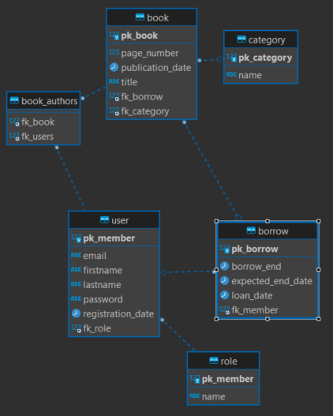

## About US

The "Persist Data" school workshop is for students
at [EPSI Students in Bordeaux](https://www.epsi.fr/campus/campus-de-bordeaux/).

It simulates a library management system.

## Usage/Examples


Click Here: 

[](https://rawcdn.githack.com/ClemLcs/WorkShopPersistData/tree/main/docs/index.html)

<br>

_If not, download the filer [index.html](./docs/index.html) then open it in your browser to access the interactive documentation._

## Tech Stack

**Server:** Spring Boot

## Environment Variables

To run this project, you will need to add the following environment variables to your environment

| Name               | Type    | Description                                                                                                          | Example               |
|--------------------|---------|----------------------------------------------------------------------------------------------------------------------|-----------------------|
| `serverPort`       | integer | Application Port                                                                                                     | 8080                  |
| `dbServer`         | string  | IP Address MYSQL Server                                                                                              | 127.0.0.1             |
| `dbPort`           | integer | MYSQL Server   Port                                                                                                  | 3306                  |
| `dbName`           | string  | MYSQL Database Name                                                                                                  | workshopPersistData   |
| `dbUser`           | string  | MYSQL Username                                                                                                       | persistData           |
| `dbPasswd`         | string  | MSQL User Password                                                                                                   | 123456                |
| `generateDDL`      | boolean | [More Info](https://docs.spring.io/spring-boot/docs/1.0.2.RELEASE/reference/html/howto-database-initialization.html) | true                  |
| `hibernateDllAuto` | string  | [More Info](https://docs.spring.io/spring-boot/docs/1.0.2.RELEASE/reference/html/howto-database-initialization.html) | update                |
| `restServerUrl`    | string  | Rest Server Url                                                                                                      | http://localhost:8085 |

## FAQ

#### Where's the documentation ?

The documentation is available on your browser and type :

- https://workshop-persist-data.locascio.fr/docs to get to the API documentation.

#### What's the E/R diagram of your database ?

Here's our E/R diagram (made with [DDBeaver](https://dbeaver.io/)) :



## Run Locally

Clone the project

```bash
  git clone https://github.com/ClemLcs/WorkShopPersistData.git
```

Go to the project directory

```bash
  cd WorkShopPersistData
```

Then start a terminal for each commands

```bash
  ./mvnw spring-boot:run
```

Now you can go on your browser and type :

- https://workshop-persist-data.locascio.fr/docs to get to the API documentation.
- http://localhost:8000 to get to the application website.

## Authors

- [@ClemLcs](https://github.com/ClemLcs)
